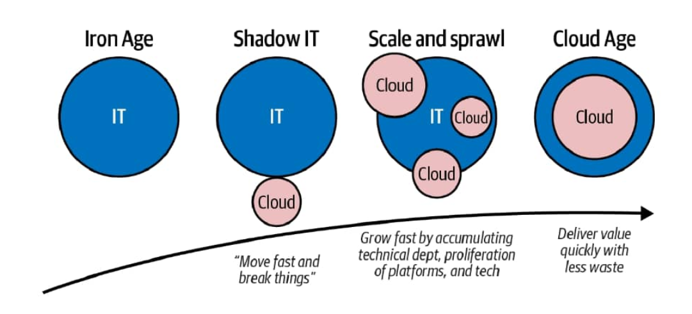
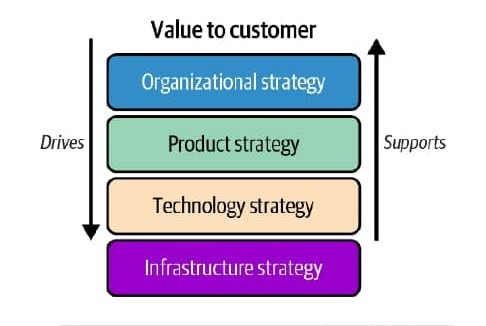

# What is Infrastructure as Code ?

## Introduction

- Master the **Principles**, **Practices**, and **Patterns**
- ***Principle***: A rule that helps you choose between potential solutions
- ***Practice***: A practice is a way of implementing something. Your should use principles to guide you in choosing the most appropriate practice for a given situation.
- ***Pattern***: A pattern is a potential solution to a problem. Each pattern is describe in a format that should help you evaluate its relevance for your problem.
- Using code to define and build infrastructure creates the opportunity to bring a wide set of tools, practices, and patterns to bear on the problem of designing and implementing systems.
- We want to build infrastructure that can continually evolve to meet changing requirements

 ### Infrastructure as Code
 - ***Infrastructure as Code*** is the practice of provisionig and managing infrastructure using code rather than command-line tools or ClickOps GUIs.
 - Infrastructure as Code is more than the mechanics of how infrastructure is defined and provisioned.

### From the Iron Age to the Cloud Age
Table 1-1. Technology changes in the Cloud Age
|                      | Iron Age             | Cloud Age                  |
|:-------------------- |:---------------------|:---------------------------|
| Types of resources   | Physical hardware    | Virtualized resources      |
| Provisioning         | Takes days or weeks  | Take minutes or seconds    |
| Processes            | Manual(runbook)      | Virtualized resources      |

### Cloud Age Approaches to Change Management
- The emergence of Cloud Age technologies has coincided with the growth of Cloud Age approaches to work, inlcuding Lean, Agile and DevOps. These approaches encourage close collaboration across roles, short feedback loops with users,
and a minimalist, quality-first approach to technical implementation. Automation  fundamentally shifts thinking about
change and risks, resulting in faster delivery and higher quality.

Table 1-2. Ways of working in the Iron Age and the Cloud Age
|                                |            Iron Age                      |           Cloud Age                |
|:-------------------------------|:-----------------------------------------|:-----------------------------------|
| Cost of change                 | High                                     | Low                                |
| Changes are                    | Risk to be minimized                     | Essential to improve quality       |
| A change of plan means         | Failure of planning                      | Success in learning and improving  |
| Optimize to                    | Reduced opportunities to failed          | Maximize speed of improvement      |
| Delivery approach              | Large batches, test at end               | Small changes, test continually    |
| Archiectures                   | Monolithic (fewer, larger moving parts)  | Microservices(more, smaller parts) |s

- Another Definition of ***Infrastructure as Code*** is a Cloud Age approach to automating cloud infrastructure in a way
that embraces continual change to achieve high reliability and quality.

### DevOps and Infrastructure as Code

- **DevOps** is, first and foremost, about people,culture and ways of working. Tools and practices like Infrastructure as Code are vaiablue to the extent that they bridge gaps and improve collaboration, but they aren't enough.

### The Path to the Cloud Age

- The mid-2010s could be considered the Shadow Age of IT. The Cloud, DevOps, continuos delivery, and Infrastructure as Code were mainly used by startups or skunkworks digital departments or larger organizations. These departments were usually set up outside the remit of the organization, partly to protect them from organization's cultural norms and formal policies, which people sometimes called "antibodies".

- The mantra of the Shadow Age ws "move fast and break things." People saw casting aside the shackles of Iro Age governance as the key to explosive growth. In the view of digital  hipsters, it was time to leave the crusty old-times to change advisory board (CAB) meetings, mainframes, and bankruptcies

Figure 1-1. The path from the Iron Age to the Cloud Age

- The period when cloud technology has been shifting from the periphery of business to the center can be called the **Age of Sprawl**.

- Larger organizations typically have multiple, disconnected teams building platforms using various technologies, multiple cloud Vendors, and varying levels of maturity and quality.

- The variety of options available for building digital infrastructure and platforms and the rapid pace of change within them have made it difficult to keep up to date. Platforms built on the latest 
technology two years ago may have already be legacy.

- Not only do we need to be choosy about which new systems and initiatives to invest in, but we also need to consider how to manage the cost of running and evolving what we already have in place.

- Instead, organizations need to find sustainable ways to grow and evolve. Call it the Age of Sustainable Growth

- What does this have to do with Infrastructure as Code ? Those involve in **designing** and **building** the foundational layers of our oganizations business systems must be aware of the **strategic drivers** those foundations must support. A key driver is rationalizing systems to sustain growth with less waste.

### The Future Is Not Evenly Distributed
- Many people and organizations have experienced the trends it describes. However, none of this "ages" have ended entirely, and many drivers of different ways of working are still valid. It's essential to recognize that context differ. A Silicon Valley startup has different needs and constraints than a transnational financial institution.

### Strategic Goals and Infrastructure as Code
- Customer value should drive the organization's strategy, which then drives stragegy to infrastructure via product and technology strategy. Each strategic layer supports the layers above it.

Figure 1-2.  Customer value driving strategy down to infrastructure